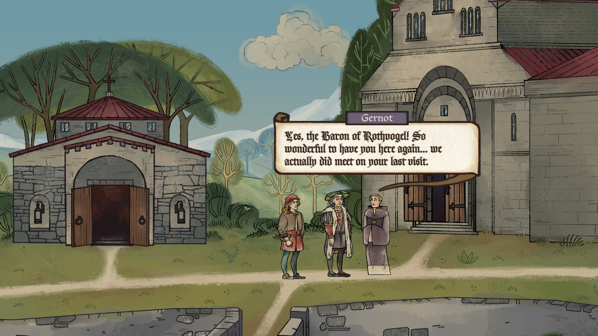
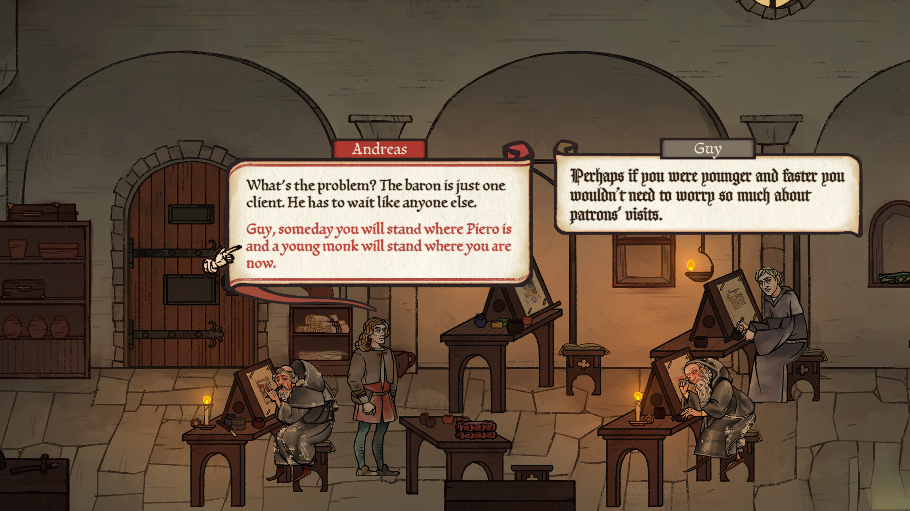
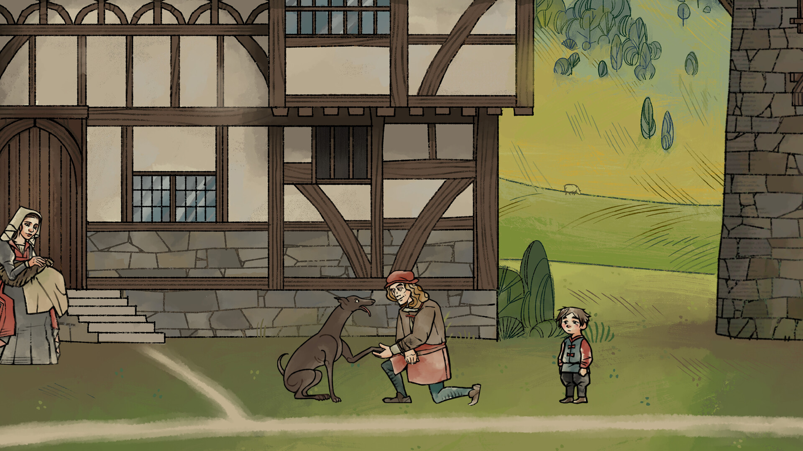

 

Quand Pentiment a débarqué en 2022, sa proposition était pour le moins audacieuse : un jeu d'enquête dans un village bavarois du début du XVIème siècle, sur fond de décors en 2D inspirés d'enluminures d'époque. Dire qu'il s'agit d'une niche n'est pas qu'un euphémisme.

Nous voilà donc au beau milieu du Saint-Empire romain germanique. Nous y incarnons Andreas Maler, un artiste érudit et voyageur, qui exerce temporairement son art aux côtés des moines copistes d'une abbaye, à proximité de la petite ville (fictive) de Tassing. Jeune et enthousiaste, Andreas se trouve rapidement confronté à un meurtre qui ébranle la communauté. Notre rôle : essayer de retrouver le coupable et éclaircir ses motivations. Pour cela, il nous faut nous balader d'un tableau à l'autre et interagir avec de nombreux personnages qui ont plein d'histoires à nous raconter. Ces dialogues, qui nous laissent la possibilité d'être sympathique ou parfaitement odieux, nous permettront d'obtenir les informations nécessaires à notre enquête.

_La police de caractère varie en fonction du niveau d'éducation des personnages_

Les choix sont souvent cornéliens, car le temps presse : nous n'aurons pas forcément le temps d'interroger tout le monde, et il nous faudra certainement prendre des décisions sans avoir pu reconstituer le puzzle dans tous ses détails, ce qui peut être frustrant. Cette frustration va de pair avec un certain manque de transparence des règles du jeu, qui sont les principaux reproches que j'ai lui faire. On ne sait pas toujours pourquoi telle décision implique telle conséquence, et certains mécanismes me sont restés opaques jusqu'au bout. Et pourtant, ce n'est pas bien grave, car ça colle plutôt bien à l'ambiance et au message de l’œuvre : l'idée d'un monde violent qui avance sans nous attendre, aux règles floues qui généralement nous échappent. Cela dit, je dois avouer que rarement un jeu m'a laissé à ce point l'impression d'avoir accumulé les mauvaises décisions, quitte à me traumatiser avec les conséquences atroces de ces dernières et me faire vivre intensément l'expérience de la culpabilité chrétienne. Etait-il possible de faire mieux ou bien tout était-il écrit à l'avance ? S'agissait-il vraiment d'une enquête ou bien d'une histoire interactive ? Le libre arbitre existe-t-il ? Ai-je envie d'avoir les réponses à ces questions ?

_L'arrivée de l'imprimerie n'est pas de bon augure pour ce vieux scriptorium_

L'intrigue débute donc en 1518, une période qu'on appelle communément le début de la Renaissance et que l'équipe de développement semble avoir pris à cœur de nous dévoiler avec subtilité, loin des images d’Épinal. A force de parcourir Tassing et de se familiariser avec sa communauté, ses métiers et ses enjeux, on constate en effet que le Moyen Âge évolue vers quelque chose de nouveau, mais que le quotidien des contemporains reste parfois ancré dans des habitudes anciennes. La religion catholique est certes secouée par des idées nouvelles, mais les fidèles continuent de vénérer des Saints très spécifiques, quand ce ne sont pas carrément de vieilles divinités païennes. L'omniprésence d'antiques ruines romaines vient d'ailleurs insister sur cette idée de temps long. Et pourtant, comme on va vite le constater, les choses bougent bel et bien à Tassing, au risque de nous emporter avec elles.

_Le rôle des femmes de Tassing est loin d'être ignoré, et ça fait bien plaisir_

Entièrement traduit en français, Pentiment est un jeu malin, d'une grande modernité dans son propos, qui prend son sujet au sérieux et qui, malgré quelques défauts au niveau des mécaniques, est amusant et donne envie d'en venir à bout (ce qui m'a pris entre 15 et 20 heures). Pour couronner le tout, il est vachement aidé en cela par sa magnifique direction artistique. Car oui, c'est superbe, c'est vivant, et certaines scènes donnent lieu à des sommets de mignonnerie que je ne suis pas prêt d'oublier. Et puis il y a des chats, et ça c'est très bien.

_Il y a aussi des chiens_